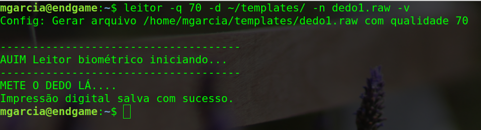
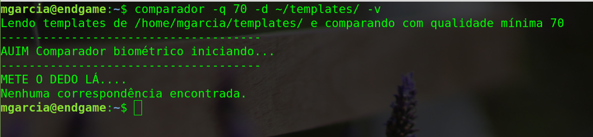

# Leitor e comparador Biométrico em C

Escrito para funcionar especificamente com o dispositivo SecuGen Hamster PRO 20. Não irá funcionar com outros dispositivos!

## Exemplos de uso:

________
1. Registrar um dedo.



2. Compararar impressão digital com um dedo cadastrado


3. Compararar impressão digital não cadastrada




## Buildar no PC
```bash
make
```

## Buildar no Raspberry
```bash
make pi
```

Os executaveis estarão disponíveis em ./bin

## Instalar os executaveis
Para instalar os executaveis e poder invocalos direto de qualquer terminal:

PI:
``` bash
make clean
make pi
sudo make piinstall
```

PC:

```bash
make clean
make
sudo make install
```

Para desinstalar, em qualquer plataforma, execute

```bash
sudo make uninstall
```


Os comandos estarão disponíveis com os nomes "leitor" e "comparador", podendo serem invocados como nos exemplos logo abaixo.

## Registrar template

Invoque o leitor passando as flags contendo:

    > Diretorio onde salvar o arquivo (-d <local>)
    > Nome do arquivo (-n <nome>)
    > Qualidade mínima da imagem (-q <valor>)

Exemplo:

> Salvar um template chamado dedo1.raw em ~/templates/ com qualidade mínima 70:


```bash
leitor -q 70 -d ~/templates/ -n dedo1.raw
```

Sempre coloque o "/" no final do diretorio onde deseja salvar o arquivo, como feito no exemplo.

## Comparar uma impressão digital atual com os templates previamente registrados

Invoque o comparador passando as flags contendo:

    > Diretorio onde ler os templates registrados (-d <local>)
    > Qualidade mínima da imagem a ser comparada (-q <valor>)

Com os templates já registrados em disco, agora podemos comparar uma impressão digital atual lida pelo sensor com todos os templates já registrados, e então retornar o template que deu match.

```bash
comparador -q 70 -d /home/pi/templates
```

de posse do nome do arquivo que deu match, o resto da lógica pode ser processado em outro serviço (API node).


# INSTALAÇÃO DAS DEPENDÊNCIAS

Para os executaveis serem compilados é necessário antes instalar os drivers proprietários da SecuGen no sistema alvo e executar algumas instruções conforme indicado no manual do dispositivo:

1. Install the following packages if not already installed on your system.
    libgtk2.0-dev (2.24.23-0ubuntu1)

2. Install the SecuGen USB Device Drivers
    cd <install_dir>/lib/linux
    make install
    If you need to uninstall, the command is (make uninstall)

3. By default, only the root user can access the SecuGen USB device because the device requires
    write permissions, To allow non-root users to use the device, perform the following steps:
    3.1 Create a SecuGen Group
        # groupadd SecuGen
    3.2 Add fingerprint users to the SecuGen group.
        #gpasswd -a myUserID SecuGen
        (substitute user name for myUserID)
    3.3 Create a file in /etc/udev/rules.d/99SecuGen.rules.
        Add the following lines:

    ```bash
    ATTRS{idVendor}=="1162", ATTRS{idProduct}=="0320", SYMLINK+="input/fdu03-%k", MODE="0660", GROUP="SecuGen"
    ATTRS{idVendor}=="1162", ATTRS{idProduct}=="0322", SYMLINK+="input/sdu03m-%k", MODE="0660", GROUP="SecuGen"
    ATTRS{idVendor}=="1162", ATTRS{idProduct}=="0330", SYMLINK+="input/fdu04-%k", MODE="0660", GROUP="SecuGen"
    ATTRS{idVendor}=="1162", ATTRS{idProduct}=="1000", SYMLINK+="input/sdu03p-%k", MODE="0660", GROUP="SecuGen"
    ATTRS{idVendor}=="1162", ATTRS{idProduct}=="2000", SYMLINK+="input/sdu04p-%k", MODE="0660", GROUP="SecuGen"
    ATTRS{idVendor}=="1162", ATTRS{idProduct}=="2200", SYMLINK+="input/u20-%k", MODE="0660", GROUP="SecuGen"
    ATTRS{idVendor}=="1162", ATTRS{idProduct}=="2201", SYMLINK+="input/upx-%k", MODE="0660", GROUP="SecuGen"
    ATTRS{idVendor}=="1162", ATTRS{idProduct}=="2203", SYMLINK+="input/u10-%k", MODE="0660", GROUP="SecuGen"
    KERNEL=="uinput", MODE="0660", GROUP="SecuGen"
    ```

    3.4 Reboot
    3.5 Note: The "ATTRS" function above is not supported by earlier Linux kernels. Use "SYSFS" instead to
        configure UDEV permissions.

4. Plug in the SecuGen USB fingerprint reader


O readme e um PDF com essas instruções e mais detalhes estão disponíveis no arquivo "FDx SDK Pro for Linux v3.85a.zip", na raiz deste repositório.